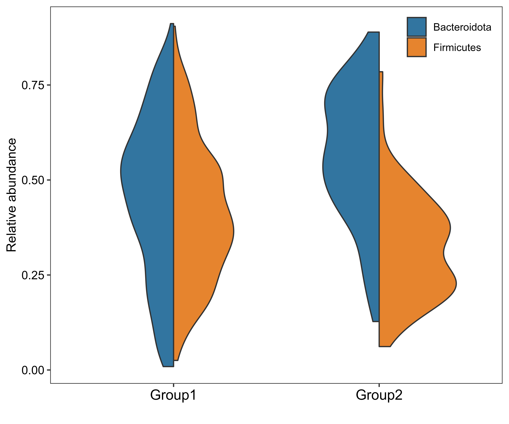

# 一些R语言分析、绘图脚本

## License and Attribution

This project is licensed under the GNU General Public License v3.0 (GPL-3.0).  
If you use or distribute any code from this repository, you are required to:
1. Retain the original copyright notice and license information.
2. Provide clear attribution to this repository as the source: [https://github.com/naFgG/Rscripts].
3. Distribute any derived works under the same license (GPL-3.0).

Failure to comply with these requirements constitutes a violation of the GPL-3.0 license.  

### Copyright

Copyright (C) [年份] [你的名字或组织名]

`pretty_pcoa.R`：记录了PCoA这类图加上置信椭圆、最外部散点连线、质心连线的方法  
  

  
`upset_plot.R`：最简单的upset图。  
左下方条形图为该集合大小；右下方点图为交集情况或涉及到哪些数据；上方条形图为下方点阵图对应交集的元素个数，只有1个点的条形图表示此数据集独有的元素个数  
  

  
`mantel.R`：Mantel检验图。   
  

  
`pca3d.R`：带置信椭圆的3D PCA图。   
  

  
`ggtreeEXTRA.R`：ggtreeExtra包画进化树+注释图。   
多圈注释，每一层信息都不同  
  
同一圈绘制两种注释，此图的第二圈用了两种注释  
  

  
`half_violin.R`：豆荚图。   
    
