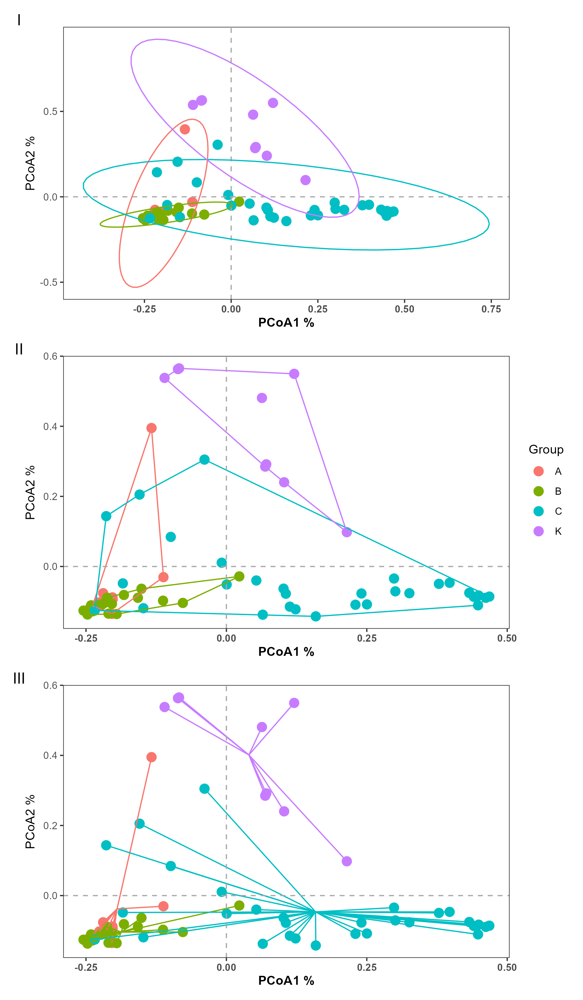
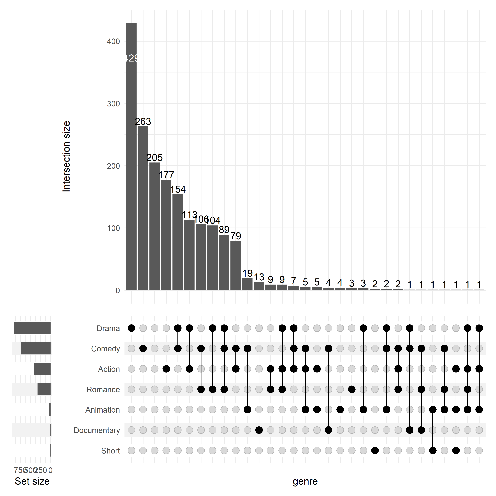
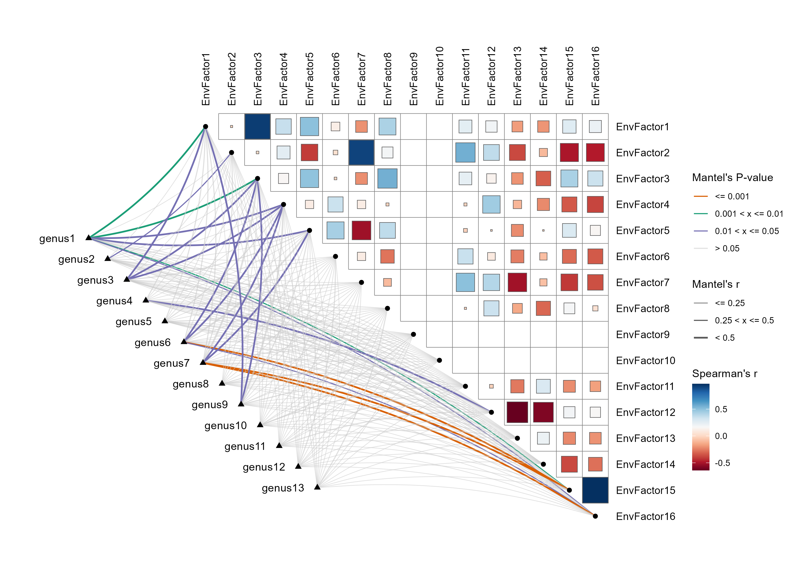
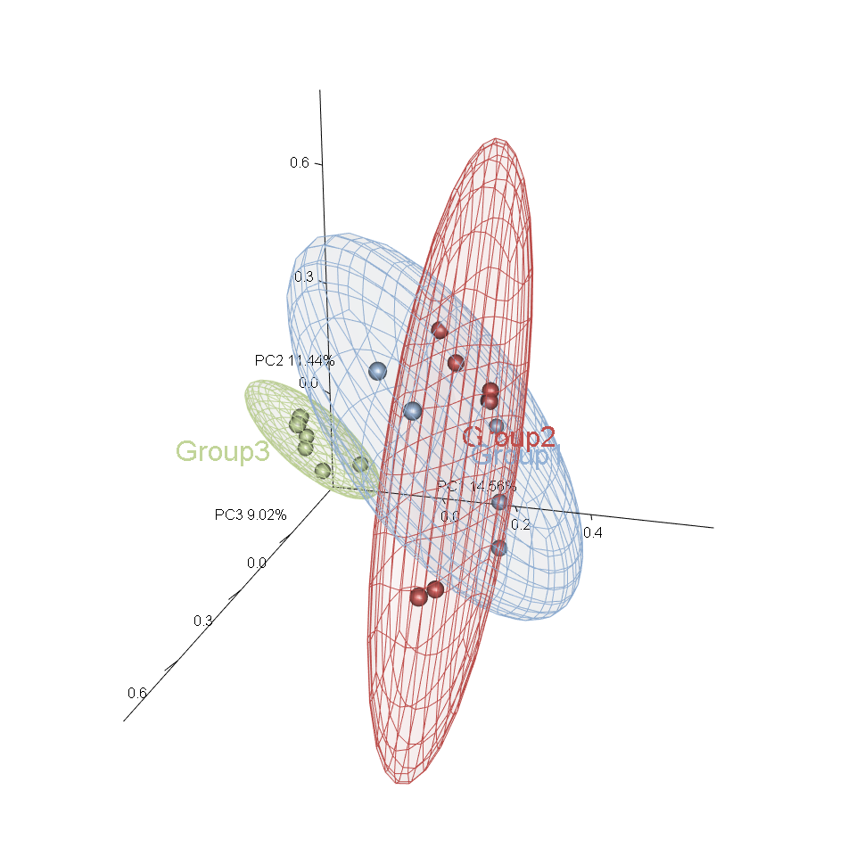

# 一些R语言分析、绘图脚本

`pretty_pcoa.R`：记录了PCoA这类图加上置信椭圆、最外部散点连线、质心连线的方法  
  

  
`upset_plot.R`：最简单的upset图。  
左下方条形图为该集合大小；右下方点图为交集情况或涉及到哪些数据；上方条形图为下方点阵图对应交集的元素个数，只有1个点的条形图表示此数据集独有的元素个数  
  

  
`mantel.R`：Mantel检验图。   
  

  
`pca3d.R`：带置信椭圆的3D PCA图。   
  

  
`ggtreeEXTRA.R`：ggtreeExtra包画进化树+注释图。   
多圈注释，每一层信息都不同  
  
同一圈绘制两种注释，此图的第二圈用了两种注释  
  
